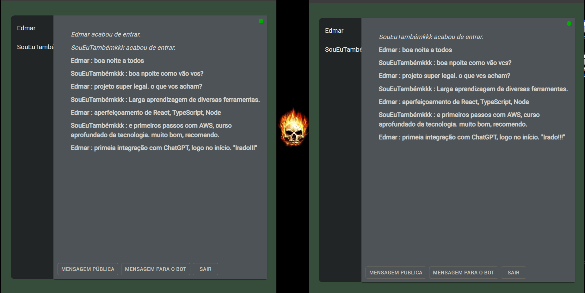

# Chat with Node React OpenAI Frontend

## Academic project for delivery
 

> Result of the completed project.
>  

> The purpose:
> - to create a functional chat that could also be integrated with
 ChatGPT in case users wanted to access it without having to access another App.

> It was a very inspiring and challenging application to develop, where I acquired knowledge of several tools and
> improved several technical skills.
>  
> The highlight was the Serverless backend, where the business logic is executed in managed cloud computing services,
> without the need to provision, manage and scale physical or virtual servers (AWS).

 

 
 

 <a href="https://master.d2uwqmfwqjokju.amplifyapp.com/" >Click here to try it out .. thanks for your interest!</a>
 
( Select Ctrl + click for open in new tab )

  
  

### Adjustments and improvements

The project was fully completed and some of the resources used were:

- [x] 
- [x] 
- [x] 
- [x] 
- [x] 
- [x] 
- [x] 
- [x] 
- [x] 
- [x] 

<h4 align="center">
  🤝 Collaborators
<h4/>
<table align="center"
  <tr>
    <td align="center">
      <a href="https://www.linkedin.com/in/edmar-radanovis-0130b611a/">
         
      
        <b>Edmar Radanovis</b>
      
      </a>
    </td>
    <td align="center">
      <a href="https://www.dio.me/">
         
      
        <b>DIO.me</b>
      
      </a>
    </td>
  </tr>
</table>
 

<h4 align="center">
  🥇 Certificates
<h4/>
<table align="center">
  <tr>
    <td align="center">
       
    </td>
    <td align="center">
       
    </td>
    <td align="center">
       
    </td>
    <td align="center">
       
    </td>
  </tr>
</table>
 
 

[⬆ Voltar ao topo](#chat-with-node-react-openai-frontend)
