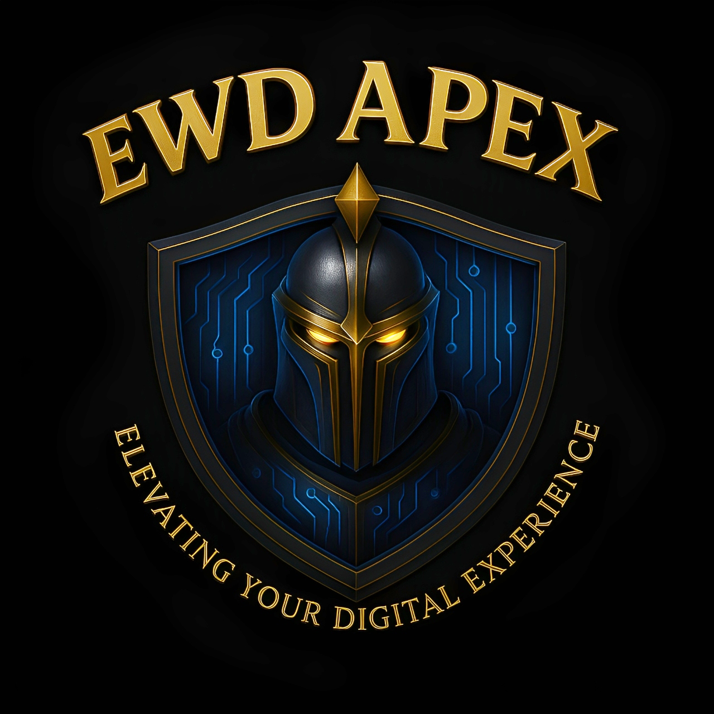
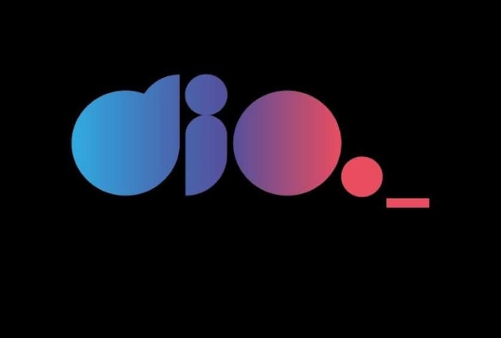

# Chat with Node React OpenAI Frontend

## Academic project for delivery

### Bootcamp AWS Cloud Week - DIO 
(taught by Cassiano Peres DIO Tech Education Analyst).
 

The result of the completed project.
  

> 🎯 Objective:
>
> - Develop a functional chat that allows instant communication between users, with an implemented integration to interact with **[ChatGPT](https://openai.com/api)** directly in the application, without needing other software.

> - This project was a challenging and enriching experience where I learned how to implement WebSocket for real-time communication and mastered the Serverless backend deployment, which was one of the highlights, since the business logic is executed in managed cloud computing services ( **[AWS Lambda](https://aws.amazon.com/lambda)**, **[API Gateway](https://aws.amazon.com/api-gateway)** and **[AWS Amplify](https://aws.amazon.com/amplify)** ( frontend ) ), without the need to provision, manage and scale physical or virtual servers, which greatly facilitated the architecture.

 

 
 

 <a href="https://master.d2uwqmfwqjokju.amplifyapp.com/" >Click here to try it out .. thanks for your interest!</a>
 
( Select Ctrl + click for open in new tab )

  
  

### Adjustments and improvements

The project was fully completed and some of the resources used were:

- [x] **Frontend**:&nbsp;&nbsp;&nbsp;&nbsp;&nbsp;&nbsp;&nbsp;&nbsp; &nbsp;&nbsp; &nbsp;&nbsp;&nbsp;&nbsp; 

- [x] **Backend**:&nbsp;&nbsp;&nbsp;&nbsp;&nbsp;&nbsp;&nbsp;&nbsp;&nbsp;&nbsp;&nbsp;&nbsp;&nbsp;&nbsp;&nbsp;&nbsp;&nbsp;&nbsp;&nbsp; 

- [x] **Integration**:&nbsp;&nbsp;&nbsp; 

- [x] **Testing**:&nbsp;&nbsp;&nbsp;&nbsp;&nbsp;&nbsp;&nbsp;&nbsp;&nbsp;&nbsp; 

- [x] **Hosting and Deployment**:&nbsp;&nbsp;&nbsp;&nbsp;&nbsp;&nbsp; 

- [x] **Database**:&nbsp;&nbsp;&nbsp;&nbsp;&nbsp;&nbsp;

#### ⚙️ Steps for the project

 ✔️ - Install the dependencies with the `npm install` command  
 ✔️ - Update the `.env` file with your OpenAI key  
 ✔️ - Compress the project contents into a `.zip` file  

#### 🌐 AWS

 ✔️ - Access the AWS console  
 ✔️ - Create a function in the AWS Lambda service  
 ✔️ - Upload the contents of the `.zip` file in the function code  
 ✔️ - Access the AWS API Gateway service  
 ✔️ - Create a Websocket API  
 ✔️ - Create the endpoints  
 
 📠Note: the first three endpoints marked with `$` are the default for an API Gateway Websocket API:  
 
 🔗 - `$connect`  
 🔗 - `$disconnect`  
 🔗 - `$default`  
 🔗 - `setName`  
 🔗 - `sendPublic`  
 🔗 - `sendPrivate`  
 🔗 - `sendBot`  

  #### 🔬 Testing Websocket

✔️ - Download the `wscat` dependency using the `npm i -g wscat` command.  
✔️ - Use the `-g` parameter to install it globally on the operating system and call it from outside the project. 
✔️ - Connect to the WebSocket API: `wscat -c <websocket_connection_url>` 
✔️ - Example calls:
- [x] Public message: `{"action":"sendPublic", "message":"Hello World!"}`
- [x] Interact with ChatGPT: `{"action":"sendBot", "message":"Which programming language has the biggest impact on the market at the moment?"}`
 

As described in the , **wscat** is recommended for testing WebSocket APIs on API Gateway, especially in real-time chat projects, collaboration platforms, multiplayer games, and financial trading platforms.

<h4 align="center">
  🤝 Collaborators
<h4/>
<table align="center"
  <tr>
    <td align="center">
      <a href="https://www.linkedin.com/in/edmar-radanovis-0130b611a/">
         
      
        <b>Edmar Radanovis</b>
      
      </a>
    </td>
    <td align="center">
      <a href="https://www.dio.me/">
         
      
        <b>DIO.me</b>
      
      </a>
    </td>
  </tr>
</table>
 

<h4 align="center">
  🥇 Certificates
<h4/>
<table align="center">
  <tr>
    <td align="center">
       
    </td>
    <td align="center">
       
    </td>
    <td align="center">
       
    </td>
    <td align="center">
       
    </td>
  </tr>
</table>
 
 

[⬆ Voltar ao topo](#chat-with-node-react-openai-frontend)
